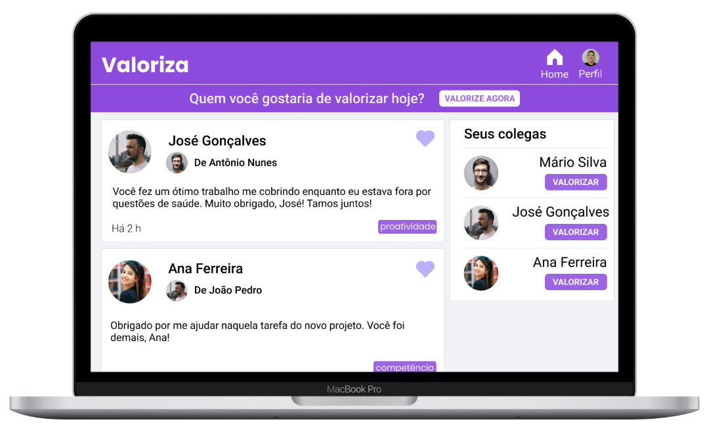

# Valoriza

O Valoriza é uma aplicação para reconhecimento entre companheiros de equipe.

## Sobre

O Valoriza promove o reconhecimento entre os companheiros de equipe, com o uso de tags, e foi baseado em um projeto da NLW Together da Rocketseat.

Design e front-end desenvolvidos por Andrew Magalhães, e back-end desenvolvido em grande parte durante a NLW.

## Status (Em desenvolvimento)

- [x] Criar nova conta
- [x] Autenticação com JSON Web Token
- [x] Redirecionamento de usuários não autenticados
- [x] Logout de usuários autenticados
- [x] Listagem dos elogios/agradecimentos
- [x] Criar novo elogio/agradacimento (reconhecimento) com mensagem e tag
- [ ] Feedback de erro/carregamento para o usuário
- [ ] Recuperação de senha
- [ ] Likes dos reconhecimentos criados
- [ ] Upload de imagem para perfil

## Layout

[Layout completo](https://www.figma.com/file/SfbULpyjra5CvJydQBe1pd/Valoriza?node-id=0%3A1)

## Tecnologias

Esse projeto foi desenvolvido com as seguintes tecnologias:

- **[Express](https://expressjs.com/)**
- **[Node.js](https://nodejs.org/en/)**
- **[React.js](https://reactjs.org/)**
- **[SQLite](https://www.sqlite.org/)**

## Licença

Esse Esse projeto está sob a licença MIT. Para mais detalhes, veja o arquivo [LICENSE](./LICENSE).
